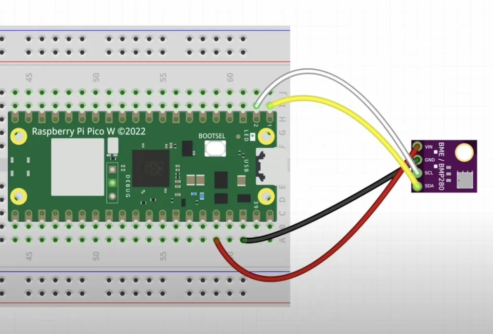
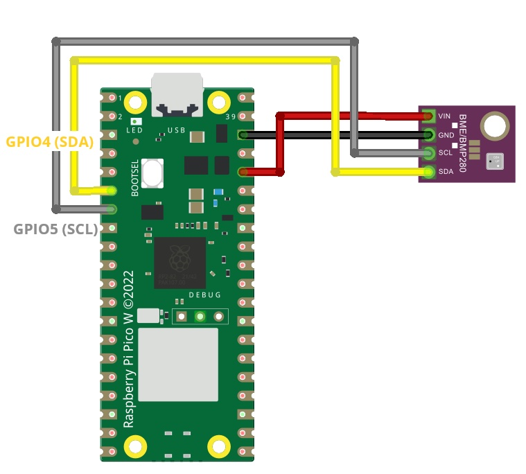

# Setting up BME280

## Wiring
[good description](https://randomnerdtutorials.com/raspberry-pi-pico-bme280-micropython/)

## Steffen ToDo

- [ ] BME280 mit RaspberryPico verbinden (siehe Bilder oben); 
- [ ] Irgendwie sinnvoll beschriften ("BME280_01", "BME280_02", ...)
- [ ] Schrumpfschlauch über Pico (und BME280?), was auch immer, ggd. später